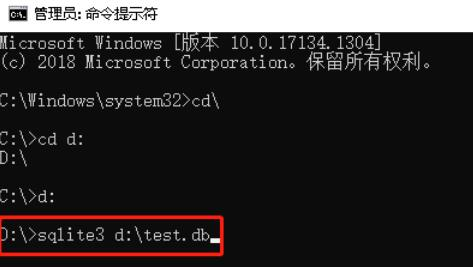
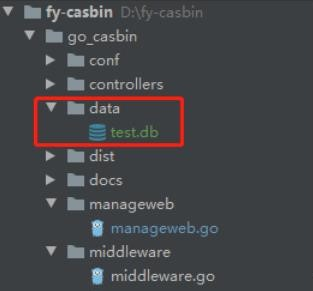
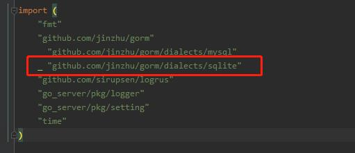
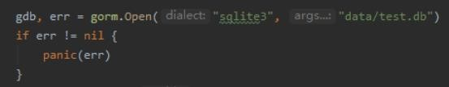
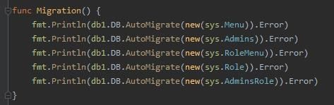

##### go项目使用sqlite数据库
* 1、在网上下载sqlite.exe
```text
sqlite3.exe
```
* 2、打开CMD，cd到sqlite.exe所在目录
##### 我存放在的d盘
```text
cd d:
```
* 3、使用命令生成db文件,生成空的test.db

```text
sqlite3 d:\test.db
```
* 4、下载sqlite的第三方库
```text
go get -u github.com/jinzhu/gorm/dialects/sqlite
```
* 5、在项目中建立data文件夹，把test.db拷入到data文件夹


* 6、导入第三方库，连接数据库





* 7、生成表




###### 使用MYSQL语句更新数据库
```text
ALTER TABLE adis_report_record  ADD company_id varchar(255) DEFAULT NULL;
UPDATE adis_report_record SET company_id = (select adis_robot.company_id FROM adis_robot WHERE adis_robot.sn = adis_report_record.sn );
```


