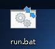

#### windows打包部署go项目
* 在Windows平台的开发环境下，go build，生成可以执行的文件main.exe,然后把配置文件夹conf和数据库go.db一起拷贝出来。在别的Windows电脑上运行时也需要这些文件。
* 2、设置脚本启动，脚本中设置配置文件和数据库的指向
```text
start cmd /c start  ./go_build_adis_server.exe  -c "./conf/app.ini"
```
#### 脚本如图
