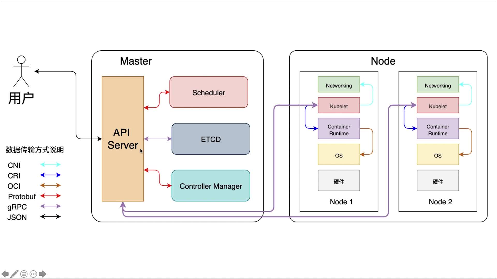
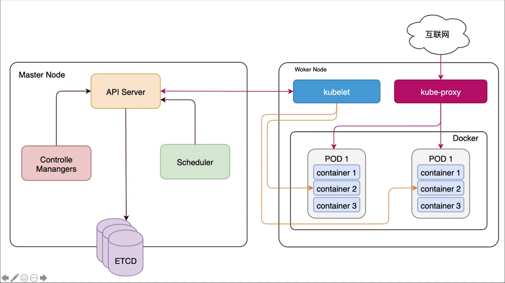
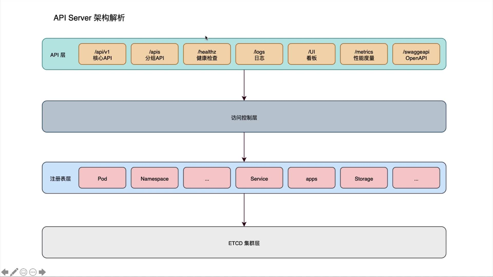
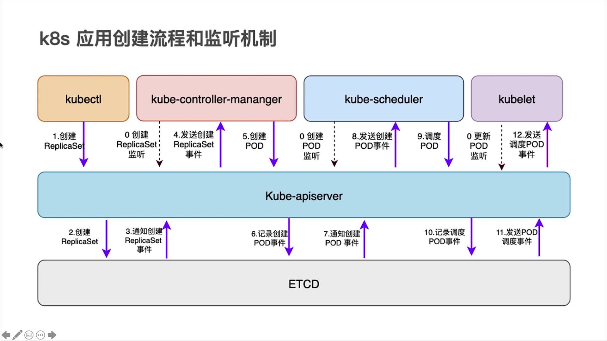
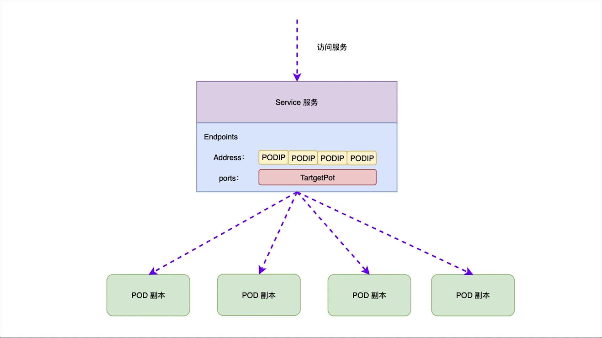

### 1、什么是k8s?
* k8s是谷歌开源的容器集群管理系统
* 可以简化应用流程的工作流，加快开发速度
* 最初由谷歌的工程师开发和设计

### 2、为什么需要k8s？
* 真正的生产型应用会涉及到许多个容器
* 容器必须跨多个服务器主机进行部署
* 借助k8s构建跨多个容器的应用服务，跨集群调度、扩展这些应用

### 3、k8s有哪些应用？
* 跨多台主机进行容器编排
* 更加充分的利用硬件，最大程度获取运行企业应用所需的资源
* 利用自动布局、自动重启、自动复制以及自动扩展功能，对应用实施状况自检和自我修复

### 4、K8s相关术语
* 主机（master）：用于控制k8s节点的计算机，所有任务分配都来源于此
* 节点（Node）：负责执行请求和分配任务的计算机，有k8s主机负责对节点的控制
* 容器集（Pod):被部署在单个节点上，且包含一个或者多个容器的容器组，同一个容器集中的所有容器共享同一个IP地址、IPC、主机名称及其他资源
* 服务（Service）：将工作内容与容器集分离
* Kubelet：运行在节点上的服务，可以读取容器清单，确保指定容器启动并运行
* Kubectl：Kubernetes的命令行配置工具

### 5、k8s架构图

### k8s核心组件
* 配置中心:etcd
* 集群管理工具:kubectl
* 节点POD管家:kubelet
* 服务外部代理:kube-proxy

### API Server架构

### k8s核心组件-Controller Manager
* 副本控制器：Replication Controller
* 节点控制器：Node Controller
* 资源控制器：Resource Controller
* 命名空间控制器：Namespace Controller
* Endpoints控制器：Endpoints Controller
* 服务控制器：Service Controller

### k8s核心组件-Replication Manager职责
* 确保在当前的集群中有且仅有N个Pod实例，N是在RC中定义的Pod的副本数量
* 通过调整RC的spec.replicas属性值来实现系统扩容或者缩容
* 通过改变RC中的Pod模板（主要是镜像版本）来实现系统的滚动升级

### k8s核心组件-ResourceQuota Manager三个层次资源配额管理
* 容器级别-可以对CPU和Memory进行限制
* Pod级别-可以对一个Pod内所有的容器的可用资源进行限制
* NameSpace级别-为Namespace（多租户）级别的资源限制，包括：POD、RC、Service、ResourceQuota、Secret、PV数量

### k8s核心组件-Service Controller 说明
* 监听service的变化
* 如果Service是一个LoadBalancer类型，则维护LoadBalancer表