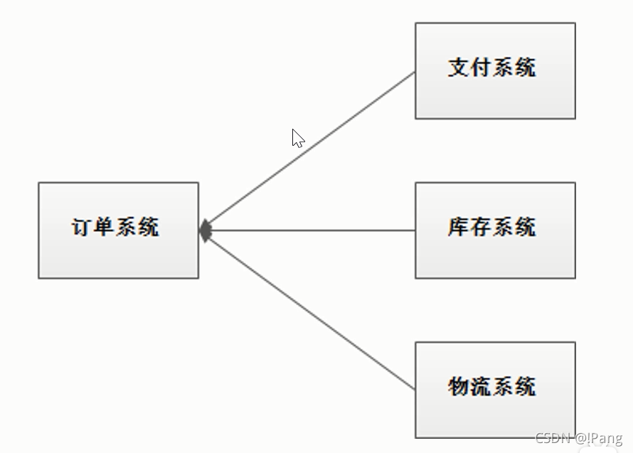

### 浅谈rocketMQ
##### 我们围绕下面9个问题来解答:
* 1.为什么要用消息队列?(消息队列的应用场景?)
* 2.各种消息队列产品的比较
* 3.消息队列的优点和缺点?
* 4.如何保证消息队列的高可用?
* 5.如何保证消息不丢失?
* 6.如何保证休息不被重复消费?(如何保证消息消费的幂等性?)
* 7.如何保证消息消费的顺序性?
* 8.大量消息堆积怎么处理?
* 9.消息过期怎么处理?

#### 1、为什么要使用消息队列？
##### 解耦、异步、削峰
##### 以电商应用为例,用户创建订单后,如果耦合调用库存系统,物流系统,支付系统,任何一个子系统除了故障或者因为升级等原因暂时不可用,都会造成下单操作异常,影响用户使用体验.

##### 系统当中一个子系统出了异常最终会导致整个业务处理失败,例如库存系统除了问题导致下单业务跟着失败.
#### 1.1 解耦

##### 使用消息队列解耦合,系统的耦合性就会降低了.比如物流系统发生故障,需要几分钟才能来修复,在这段时间内,物流系统要处理的数据被缓存到消息队列中,用户的下单操作正常完成.当用户的下单操作正常完成.当物流系统恢复后,补充处理存在消息队列中的订单消息即可,终端系统感知不到物流系统发生过几分钟故障.

##### 用户通过订单系统下单,下单之后,订单系统处理完自己的业务,订单系统把其他系统需要处理业务用的数据以消息的形式转存到MQ,三个系统都是消息的消费方法,一直在监听着MQ有没有新的消息,只要有消息就会自己去取出消息进行消费.
      
##### 异常情况:如果库存系统挂了,用户感知不到后台的异常,因为MQ中间解耦了,只要订单系统没有抛出异常,当前下单就成功了.但是库存系统处理失败了,等重启成功之后再去MQ拿消息消费即可,所以底层一个系统出现故障不会影响到用户下单这个行为,这就是MQ第一个应用场景叫做解耦.

#### 1.2 异步

##### A系统接收一个请求,需要在自己本地写库,还需要在B,C,D三个系统写库,自己本地写库要3ms,B,C,D三个系统写库分别要300ms,450ms,200ms.最终请求延时是3+300+450+200=953ms,接近1s,用户体验非常不好,一般互联网类的企业,对于用户直接的操作,一般要求是每个求情都必须在200ms以内完成,对用户几乎是无感知的,如果用户通过浏览器发起请求,等待个1s,这几乎是不可接受的.
      
##### 如果使用MQ,那么系统连续发送3条消息到MQ队列中,加入耗时5ms,A系统从接收一个请求到返回响应给用户,总时长是3+5=8ms,对于用户而言,响应速度大大提升了,改善了用户的体验.
      
#### 如果A响应需要用到B,C,D的处理结果,这种架构就不行了.所以要用MQ要考虑到业务场景.

#### 1.3 削峰
##### 应用系统如果遇到系统请求流量的瞬间猛增,有可能会将系统压垮,有了消息队列可以将大量求情缓存起来,分散到很长一段时间处理,这样可以大大提高系统的稳定性和用户体验.

##### 例如双十一秒杀活动,大量用户蜂拥而至,考验系统能不能扛得住,如何应对这种突然大流量的请求来了之后,保证系统稳定性,不宕机呢?

##### 一般情况,为了保证系统的稳定性,如果系统负载超过阈值,就会阻止用户请求.这会影响用户体验,这时候如果使用消息队列将请求缓存起来,等待系统处理完毕后通知用户下单完毕,这样比不能下单体验要好很多.

#####请求来了之后先放到MQ之中,MQ是个消息容器,请求过来的是数据.把数据以消息的形式封装起来存放到MQ之中,MQ会把数据放置到内存当中,内存的抗压能力比数据库强的多,假设每秒5000个请求访问数据库,由于使用了MQ,A系统每秒只拉取2000个请求下来写入数据库,数据库2.5秒可以处理完,虽然不是立即处理完,但是现在保证了系统的稳定性没有宕机.

#### **流量削峰的经济考量**
##### 业务系统正常时间段的QPS如果是1000,流量高峰是10000,为了应对流量高峰配置高性能的服务器显然不划算,这是可以使用消息队列对流量峰值进行削峰.

##### 例如 : 我们今天要进行秒杀服务,提前判QPS峰值是10000,但是平时是1000.搭架构时候是奔着搭建1000QPS还是搭建1WQPS?

##### 如果是1K秒杀开始系统必挂,搭建1WQPS大部分时间系统很多资源限制,1WQPS要买很多的设备,但是秒杀可能半小时就结束了.为了半小时增加这么大成本不划算.公司以盈利为主1K,1W都不靠谱,那就准备1000的设备,但是好药能抗住1W的压力,通过MQ进行流量削峰,就可以节省公司成本了.

[原文链接](https://blog.csdn.net/weixin_44317412/article/details/120049791)

[linux下docker安装rocketMq](https://blog.csdn.net/weixin_44470298/article/details/107975575)

[rocketmq查看命令](https://www.cnblogs.com/gmq-sh/p/6232633.html)

[rocketmq创建topic](https://www.cnblogs.com/zjfjava/p/13891640.html)

[docker部署rocketmq](https://www.cnblogs.com/Leo_wl/p/11796697.html)
